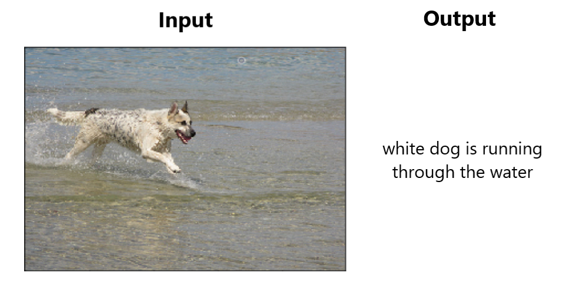

# Autocaption
> Image caption generation in PyTorch using an encoder-decoder architecture

<p align="center">
  
</p>

## Overview
This work implements a variant model based on the paper [Show and Tell: A Neural Image Caption Generator](https://arxiv.org/pdf/1411.4555.pdf). Given an image, the model is able to describe in natural language the contents of the image. The model is comprised of the encoder, a pretrained CNN, which extracts high-level features from the image and feeds them to the decoder, an LSTM, which generates the sequences of words. 
For more details check out the report and presentation under [`docs`](docs).

# Prerequisites
* Conda or Virtualenv
* Flickr8k dataset for training (downloadable [here](http://academictorrents.com/details/9dea07ba660a722ae1008c4c8afdd303b6f6e53b))

## Installation
* Extract the images from the Flickr8k dataset under `./data/images`
```sh
$ git clone https://github.com/nhabbash/autocaption
$ cd autocaption
$ conda env create -p .\cenv -f .\environment.yml # using conda
$ jupyter nbextensions_configurator enable --user # optional
```

# Training
Uses:
* [PyTorch](https://github.com/pytorch/pytorch) for deep learning
* [Ax](https://github.com/facebook/Ax/) for hyperparameter tuning
* [Weights and Biases](https://www.wandb.com/) for experiment tracking

#
## Authors
* **Nassim Habbash** - [nhabbash](https://github.com/nhabbash)
