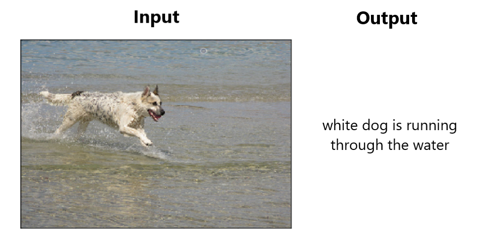

# Autocaption
> Image caption generation in PyTorch using an encoder-decoder architecture

<p align="center">
  
</p>

## Overview
This work implements a variant model based on the paper [Show and Tell: A Neural Image Caption Generator](https://arxiv.org/pdf/1411.4555.pdf). Given an image, the model is able to describe in natural language the contents of the image. The model is comprised of the encoder, a pretrained CNN, which extracts high-level features from the image and feeds them to the decoder, an LSTM, which generates the sequences of words. 

#### [Live demo](https://nhabbash.github.io/autocaption)
#### [Documentatation](docs/report.pdf)
#### [Slides](docs/slides.pdf)

# Prerequisites
* Conda or Virtualenv
* Flickr8k dataset for training (downloadable [here](http://academictorrents.com/details/9dea07ba660a722ae1008c4c8afdd303b6f6e53b))

## Installation
* Extract the images from the Flickr8k dataset under `./data/images`
```sh
$ git clone https://github.com/nhabbash/autocaption
$ cd autocaption
$ conda env create -p .\cenv -f .\environment.yml # using conda
$ jupyter nbextensions_configurator enable --user # optional
```

# Training
Uses:
* [PyTorch](https://github.com/pytorch/pytorch) for deep learning
* [Ax](https://github.com/facebook/Ax/) for hyperparameter tuning
* [Weights and Biases](https://www.wandb.com/) for experiment tracking

For a detailed example, check the training notebook under  [`./notebooks/training`](./notebooks/training)

# Notes
* The best model obtained after training and hyperparameter tuning achieves an average BLEU score on the test split of 11, compared to 27.2 of the original paper. (See the [report](docs/report.pdf) or the [slides](docs/slides.pdf) for more details on the performance)
* The model works best with pictures similar to those it has been trained on. In the case of Flickr8k, pictures with one or two subjects doing some simple activities. It works pretty good with dogs playing around and people engaging in a couple of sports (e.g. surfing).
* The API of the demo is deployed on Heroku, it might take some time to get a caption. Locally on CPU it takes about 5 seconds.

## Authors
* **Nassim Habbash** - [nhabbash](https://github.com/nhabbash)
